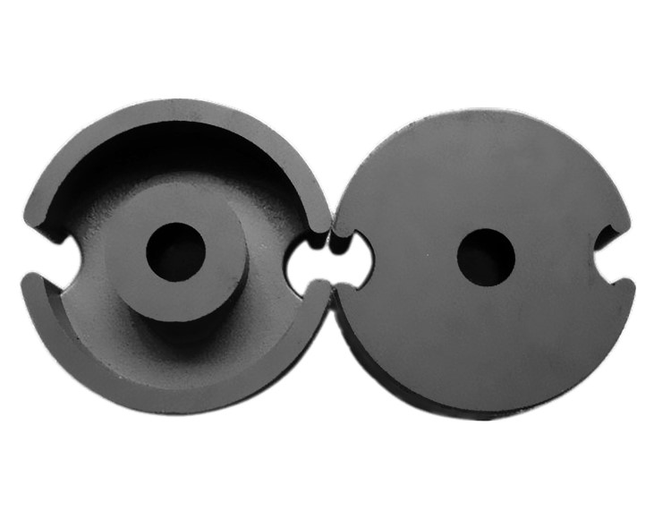
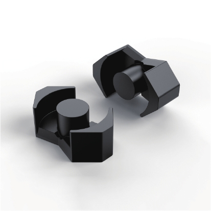
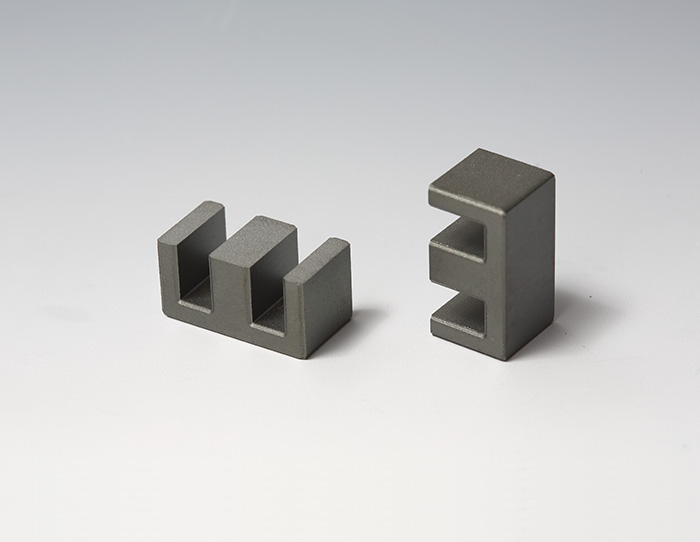
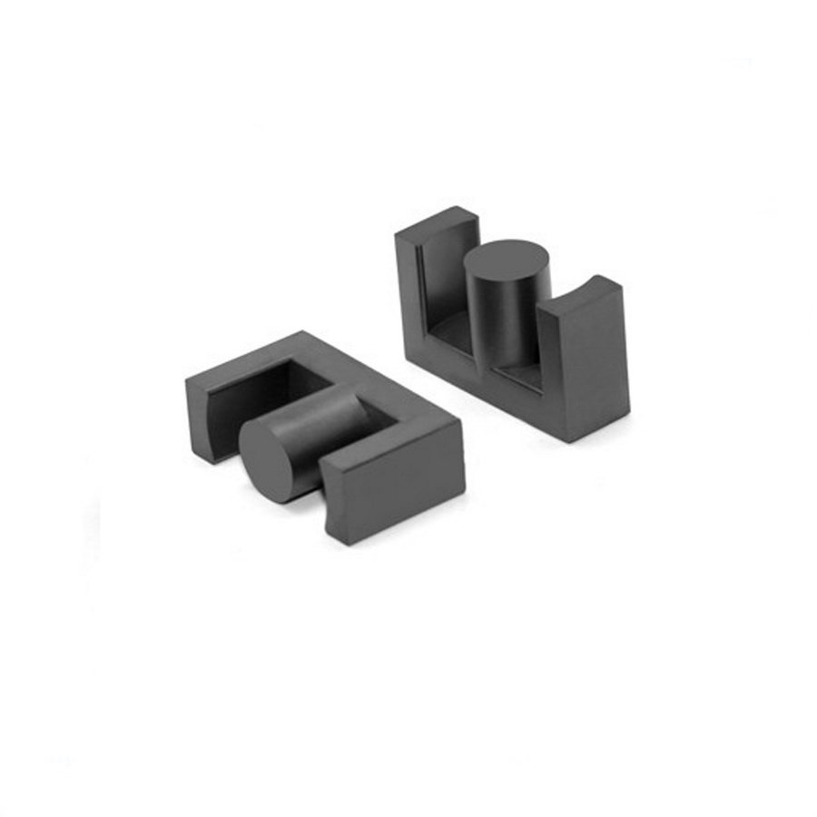
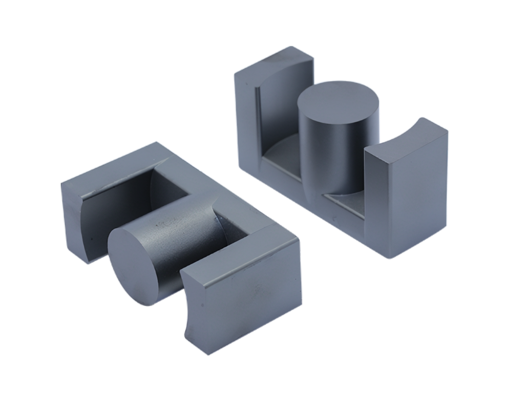
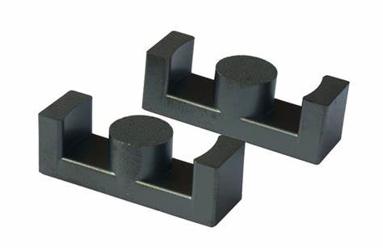
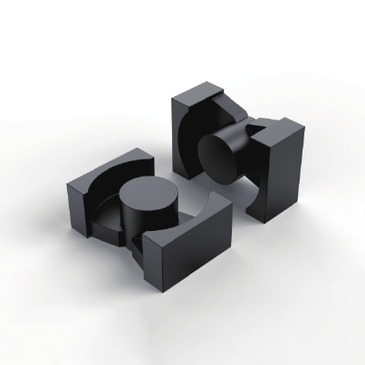
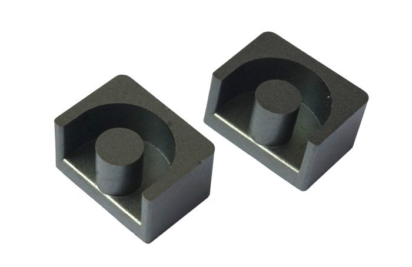
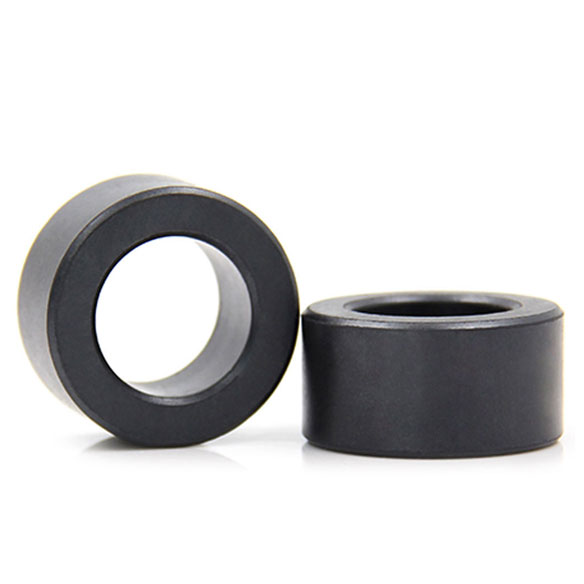

# 逆变器设计

## 时间

## 变压器与电感设计

### 高频变压器磁芯类型
高频变压器是变换交流电压、电流和阻抗的器件，当初级线圈中通有交流电流时，铁芯（或磁芯）中便产生交流磁通，使次级线圈中感应出电压（或电流）。变压器由铁芯（或磁芯）和线圈组成，线圈有两个或两个以上的绕组，其中接电源的绕组叫初级线圈，其余的绕组叫次级线圈。变压器的磁芯包括罐型磁芯，RM型磁芯，E型磁芯，EC、ETD和EER型磁芯，PQ型磁芯，EP型磁芯，EP型磁芯，环形磁芯等磁芯，那么这些磁芯对变压器的工作有何影响呢？下面请看具体的分析。

#### 罐型磁芯

骨架和绕组几乎全部被磁芯包裹起来，致使它对EMI的屏蔽效果非常好;罐型磁芯尺寸均符合IEC标准，在制造的时候互换性非常好;可提供简单型骨架(无插针的)和PCB板安装骨架(有插针);由于罐型形状的设计，致使与其它类型同等尺寸的磁芯相比费用更高;由于它的形状不利于散热，因此不适于应用于大功率变压器电感器。

#### RM型磁芯

与罐型相比，切掉了罐型的两个对称的侧面，这重设计更有利于散热和大尺寸的引线引出;与罐形相比，节约了大约40%的安装的空间；骨架有无针型的和插针型的;可以采用一对夹子进行安装;RM型磁芯可以作成扁平形状(适合现在的平面变压器或者是直接把磁芯装配到已经设计好绕组的印制板电路上);虽然屏蔽效果不如罐型的好，但是仍然不错

#### E型磁芯

与罐型磁芯相比，E型磁芯的费用要低的多，再加上绕制和组装都比较简单，这种磁芯形状现在应用最广，但是它的缺点是不能提供自我屏蔽;E型磁芯可以进行不同方向的安装，也可以几付叠加应用更大的功率;这种磁芯可以作成扁平形状(是现在平面变压器很流行的磁芯形状)；也可以提供无针和插针型骨架;由于其散热非常好、可以叠加使用，一般大功率电感器和变压器都使用这种形状的磁芯。

#### EC、ETD和EER型磁芯

这些类型的磁心结构介于E型和罐型之间。和E型磁芯一样，他们能提供足够的空间供大截面的引线引出(适合现在开关电源低压大电流的趋势);这些形状的磁心散热也非常好;有于中心柱为圆柱形，与相同截面的长方体相比，单匝的绕组的长度缩短了11%，这样致使铜损也降低了11%，同时使的磁心能提供一个更高的输出功率;同时中心柱为圆柱形，与长方体中心柱相比，也避免了由于长方体棱角在绕制时破坏绕组线材绝缘的隐患。

EC型磁芯

ETD型磁芯

EER型磁芯

#### PQ型磁芯

PQ型磁芯专门为开关电源用电感器和变压器设计。PQ形状的设计优化了磁芯体积、表面积和绕组绕制面积之间的比率;这种设计，使的使用最小的磁芯提供最大的电感量和最大化的绕制面积成为可能;这种设计，使得在最小的变压器体积和重量下，获得最大的输出功率，并且占用最小的PCB安装空间;可以使用一付夹子进行安装固定;这种有效的设计也使的磁芯的磁路截面积更加统一，因此这种磁芯结构也使得比其它的磁芯结构设计有更少的工作热点。

#### EP型磁芯

EP型磁芯的圆形中心柱立体形结构，除了与PCB板接触的末端外，完全的把绕组包裹了起来，屏蔽非常好;这种独特的形状最小化了在两片磁芯装配时接触面形成的气隙的影响，并且提供了一个更大的体积和总的空间利用率的比例。

#### 环形磁芯

对于制造商来说，环型磁芯是最经济的，在与其可比较的各种磁芯中，它的花费是最低的（不过个人觉得对于变压器绕制厂商的绕制成本比较高）;由于使用骨架，附加的和组装的费用等于零;适合时可以使用绕线机进行绕制;它的屏蔽也是非常不错的。

### 漏感

实际上，存在一些磁通，通过“泄漏”到空气中或通过其他机制，连接一个绕组，但不连接另一个绕组。 如下图所示，该磁通会产生漏感，即与绕组串联的附加有效电感。 拓扑等效结构如图 10.17b 所示，其中漏磁通 $\Phi_{l1}$ 和 $\Phi_{l2}$ 明确显示为单独的电感器。

下面这个图说明了变压器电气等效电路模型，包括对漏感进行建模的串联电感器 $L_{l1}$ 和 $L_{l2}$。 这些漏感导致端电压比 $v_2(t)/v_1(t)$ 与理想匝数比 $n_2/n_1$ 不同。

不与两个绕组交链的磁路磁通是与初级漏感$L_P^\sigma$和次级漏感$L_S^\sigma$相对应的漏磁通。 参考图1，这些漏感是根据变压器绕组开路电感和相关的耦合系数或耦合系数$k$来定义的。
初级开路自感由下式给出：  
$L_{oc}^{pri}=L_P=L_M+L_P^{\sigma}$  
其中：  
$L_P^\sigma=L_P\cdot(1-k)$  
$L_M=L_p\cdot k$  
以及：

- $L_{oc}^{pri}=L_{P}$是初级电感
- $L_{P}^{\sigma }$是初级漏感
- $L_M$为励磁电感
- $k$是电感耦合系数  

因此，开路自感和电感耦合系数 k 由下式给出  
$L_{oc}^{sec}=L_{S}=L_{M2}+L_{S}^{\sigma}$  
和  
$k={\frac {\left|M\right|}{\sqrt {L_{P}L_{S}}}}$  
其中  
$0<k<1$  
其中  
$L_S^\sigma=L_S\cdot(1-k)$  
$L_{M2}=L_{S}\cdot{k}$  
和
- $M$是互感
- $L_{oc}^{sec}=L_S$是次级自感
- $L_{S}^{\sigma}$是次级漏感
- $L_{M2}=L_{M}/a^{2}$是指次级励磁电感
- $k$是感性耦合系数
- $a\equiv {\sqrt {\frac {L_{p}}{L_{s}}}}\approx N_{P}/N_{S}$是近似匝数比

### 变压器的耦合系数测量

#### 方法一
变压器自感$L_{P}$ &$L_{S}$和互感$M$在两个绕组的加法和减法串联连接中，由下式给出

在加法连接中：  
${L_{ser}^{+}=L_{P}+L_{S}+2M}$  
在减法连接中：  
$ L_{ser}^{-}=L_{P}+L_{S}-2M$  
这样这些变压器电感可以通过以下三个方程确定：  
$L_{ser}^{+}-L_{ser}^{-}=4M$  
$L_{ser}^{+}+L_{ser}^{-}=2\cdot (L_{P}+L_{S})$  
$L_{P}=a^{2}.L_{S}$。

#### 方法二
您可以通过漏感确定耦合系数。  
$k=\sqrt{\frac{L_P−L_{lP}}{L_P}}$  
其中：  
$L_P$=初级电感，次级开路  
$L_{lP}$=初级电感，次级短路（漏感）  
如果绕组是无损的，则该方程成立。 您还可以从次级侧测量$k$。 
如果引入损耗，则耦合系数变为：
$k_{实际}=k_{表观测量}\sqrt{\frac{1+Q^2}{Q^2}}$  
如果绕组 $Q$（在次级短路时测量）高于 4，则实际 $k$ 与测量的 $k$ 之间的误差将小于 3%。 
这表示您应该在足够高的频率下执行$k$测量，其中$Q$将足够高以减少测量值和实际$k$之间的误差，但低于共振。

## LLC变换器
不断增加的开关电源功率密度，已经受到了无源器件尺寸的限制。
采用高频运行，可以大大降低无源器件（如变压器和滤波器）的尺寸。但过高的开关损耗势必成为高频运行的一大障碍。
谐振变换器由于能实现软开关，有效地减小开关损耗和容许高频运行，所以在高频功率变换领域得到广泛的重视和研究。
与传统PWM（脉宽调节）变换器不同，LLC是一种通过控制开关频率（频率调节）来实现输出电压恒定的谐振电路。

### LLC变换器的拓扑结构
LLC谐振电路由开关网络（半桥或全桥）、谐振电容（C）、谐振电感（L）、变压器励磁电感（L）、变压器和整流器组成。

#### 半桥LLC
也称非对称半桥LLC，一般用于小功率场合，具有开关管数量少等特点。

#### 电容分立半桥LLC
也称对称半桥LLC，工作原理与对称半桥LLC一样，只是谐振电容容量小，电流峰值也会较小。

#### 全桥LLC

全桥LLC开关管相对于半桥LLC多，适用于大功率场合。

### 谐振软开关

普通拓扑的开关管都是硬开关，在导通和关断时MOS管的漏源极电压VDS和电流IDS会产生交叠，电压与电流交叠的区域，即为MOS管的导通损耗和关断损耗。
为了降低开关管的开关损耗，提高电源的效率，有零电压开关（ZVS）和零电流开关（ZCS）两种软开关办法。

#### 零电压开关（ZVS）
使开关开通前其两端电压为零，也成为零电压开通。

#### 零电流开关（ZCS）
由于开关损耗与流过开关管的电流和开关管上的电压的乘积（V*I）有关，当采用ZVS零电压导通时，开关管上的电压几乎为零，所以导通损耗非常低。

#### LLC软开关
LLC正是实现了ZVS零电压开关。
要实现零电压开关，开关管的电流必须滞后于电压，使谐振槽路工作在感性状态。
LLC开关管在导通前，电流先从开关MOS管的体二极管（S到D）内流过，开关MOS管D-S之间电压被箝位在接近0V（二极管压降），此时让开关MOS管导通，可以实现零电压导通。
MOS管VDS电压和电流波形如下图所示，可以看出，在MOS开通（VDS降为0）时刻，MOS管电流为负值（中间图蓝色部分），说明电流反向流经MOS体二极管，开关MOS管D-S之间电压被箝位在接近0V附近，此时MOS导通即可实现零电压开通。

### LLC谐振电感外置与集成的优缺点
LLC电源里面有一个谐振电感与谐振电容，但是很多时候见到的实际PCB板里面只有LLC变压器与谐振电容，并没有谐振电感，这个谐振电感是集成到了变压器里面了，那么这个电感其实就是利用了原副边的漏感来做的谐振电感，在硬开关里面漏感是我们不想要的，希望他越小越好，因为漏感上面储存的能量还需要专门要做一个电路进行出来，但是谐振变换器里面漏感是有益的，可以用来做谐振电感，这样就可以不用再做一个电感来做谐振电感，这就是集成谐振电感的变压器。而有些电源是有独立的谐振电感与变压器的，这种就是外置谐振电感的电路，下面我们就来讨论下这两种电感的方法优缺点。
#### 外置谐振电感的优点
外置谐振电感是一个单独的电感，与主变压器是分离开的，这设计起来就非常灵活了，虽然感量是通过具体的设计得来的，但是具体的电感可以用不同的材质，来优化电感上面的损耗，并且可以把功率密度做高，而且主变压器的磁芯骨架的选择比较多。外置谐振电感对于我们变压器的调整是没有影响的，因为在调试的过程中，可能我们的原边圈数有可能调整，调整原边绕组就会影响漏感，因为是分立的变压器，一般漏感都控制的非常低，与外置的谐振电感比起来是非常小的，所以微调原边的圈数，对谐振电感的影响不是很大，可以忽略。

#### 外置谐振电感的缺点
外置谐振电感的成本是要比集成的要高，这是单独制作了一个电感，材料上面就会多出来的磁芯和骨架、绕电感的铜线等，然后就是工时成本了，一个是电感制作成本，然后就是电源制作的时候需要插件的成本。谐振电感工作的电流是交流的，所以磁感应强度工作在第一象限与第三象限，为了磁芯的损耗不是很大，一般Bmax取值都比较低，这样导致用铁氧体磁芯的时候中柱开的气息比较大，很容易引起谐振电感的涡流损耗比较大，导致温度比较高。

#### 集成式的谐振电感的优点：

集成谐振电感在材料与人工上面可以节省下来一些成本，但是集成式的电感需要专门的骨架来绕制才可以，因为是漏感做谐振电感，一般计算出来的谐振电感的感量占主感量的20%了，也就是说漏感需要达到原边感量的20%，这样原边与副边的耦合不需要很好。
为了把漏感做大，我们一般需要用到一些专业的骨架，这种骨架带来的好处就是漏感大，并且原副边的寄生电容变小了，这样对于我们的LLC是有一定好处了。一般我们用的集成式的骨架是把原边与副边分开的分槽骨架，这样原副边之间的安规就要比分立的好很多，可以原副边的都用漆包线，原副边的安规基本可以不用考虑，并且整个绕制都要简单很多。

#### 集成式谐振电感的缺点：

这种集成式的变压器的缺点也是非常明显，整个变压器体积要比普通的大很多，因为是分槽绕制的，所以绕制空间一般需要比较大，并且漏感需要比较大，这种骨架一般都是需要订制，这样对于成本来说就会增加，当然如果量比较大，多出来的成本基本可以忽略。因为谐振电感就是原边的漏感，所以在绕组原边圈的时候对漏感的大小影响非常的大，一旦固定下来谐振漏感，那圈数就不好调整，所以集成式谐振电感一般做的功率不是很大，到了上千瓦的功率基本就都是用分立电感来做谐振电感。

### LLC变换器的磁集成变压器
在设计LLC变换器的磁集成变压器时，需要考虑以下几个关键因素：
- 磁芯选择：选择适合LLC变换器应用的磁芯材料和类型。常用的磁芯材料包括铁氧体、磁性合金等，而常见的磁芯类型有E型、EC型、EFD型等。选择合适的磁芯材料和类型可以满足所需的磁性特性，如磁感应强度、损耗、饱和磁感应等。
- 匝数和线径设计：根据LLC变换器的输入输出电压比和功率需求，设计合适的匝数和线径。匝数的选择影响变压器的变比和电感值，线径的选择决定了变压器的电阻和电流承载能力。合理的匝数和线径设计可以提高效率和功率密度。
- 绝缘和安全：由于LLC变换器工作在较高的电压和功率下，确保磁集成变压器的绝缘和安全性是至关重要的。选择合适的绝缘材料和绝缘距离，采取适当的绝缘措施，以防止电击和保护系统的可靠性。
- 磁芯和绕组的热管理：在LLC变换器中，磁集成变压器通常会产生一定的热量。因此，需要考虑磁芯和绕组的热管理，确保温度在安全范围内。合理布局散热器、散热孔和散热层，以提高散热效果。
- 仿真和优化：在进行磁集成变压器设计之前，进行电磁仿真和优化是非常有帮助的。通过仿真软件模拟变压器的电感、损耗、磁场分布等参数，以便优化设计并满足所需的性能指标。重要的是，磁集成变压器设计需要结合LLC变换器的具体要求和应用环境进行综合考虑。

## 基于有限元的变压器仿真

### 变压器的漏感计算

- For a W-winding device, the number of leakage inductance = W(W-1)/2
- Maxwell matrix automatically calculated self inductances, mutual inductances and coupling coefficients
- Leakage inductance between a pair of winding must be calculated manually using: Maxwell 3D > Results > Output Variables
- Leakage inductance must be referred to one set of terminals (pri, sec, tertiary, ...)
- Two possible methods where N = turns ratio between winding pair: 
#### Mehtod1. using coupling coefficient (easier)
$L_{leakage12} = L_{11}(1-k_{12}^2)$
#### Method2. using inductance matrix
$L_{leakage12} = L_{11}-N(L_{12}+N_{21})+N^2L_{22}$ 