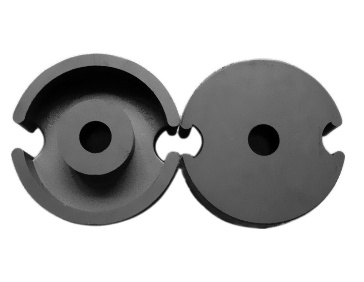
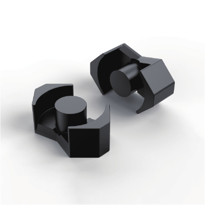
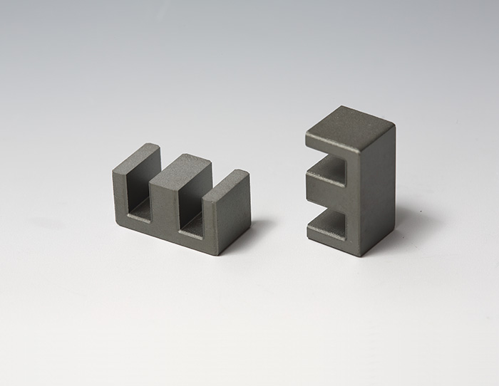
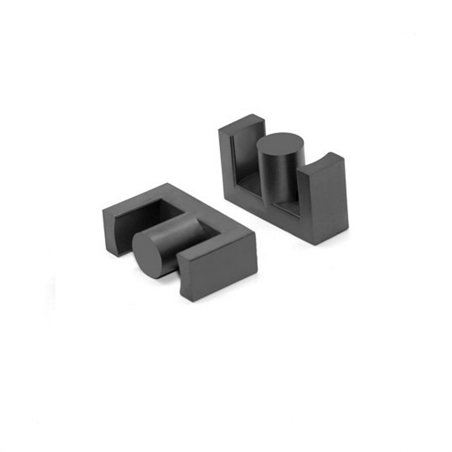
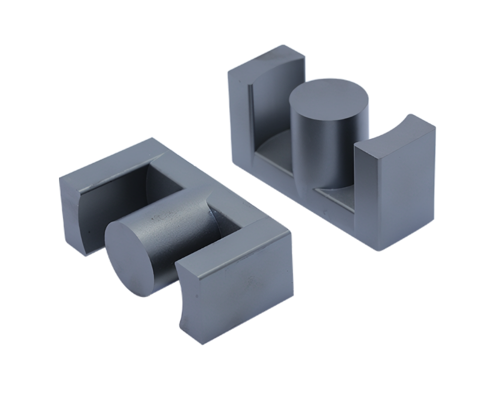
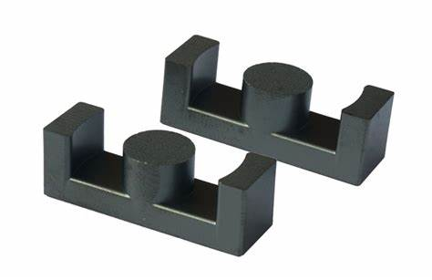
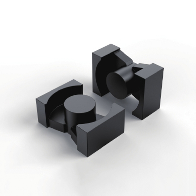
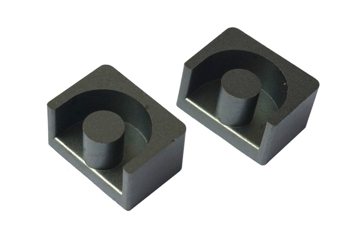

## 概述

逆变器设计需要在拓扑、开关器件、驱动电路、磁性元件、散热与 EMI 之间进行系统权衡。SiC 与 GaN 器件的高速开关能力允许提高开关频率，从而缩小变压器、电感和滤波器体积，但频率升高也带来磁性元件损耗、寄生参数和驱动设计的挑战。本章重点介绍逆变器中高频变压器与电感的设计基础，以及 LLC 谐振变换器的磁性元件设计方法。

## 变压器与电感设计

### 高频变压器磁芯类型

高频变压器用于变换交流电压、电流和阻抗。当初级线圈中通有交流电流时，磁芯中便产生交变磁通，使次级线圈中感应出电压（或电流）。变压器由磁芯和线圈组成，线圈有两个或两个以上的绕组，其中接电源的绕组叫初级线圈，其余的绕组叫次级线圈。常用的磁芯形状包括罐型、RM 型、E 型、EC/ETD/EER 型、PQ 型、EP 型、环形等，下面分别分析这些磁芯对变压器设计的影响。

#### 罐型磁芯

骨架和绕组几乎全部被磁芯包裹起来，对 EMI 的屏蔽效果非常好；罐型磁芯尺寸符合 IEC 标准，互换性好；可提供无插针的简单型骨架和 PCB 板安装骨架。由于罐型结构的制造和绕制成本较高，且不利于散热，因此不适于大功率变压器和电感器。

#### RM型磁芯

与罐型相比，RM 型磁芯切掉了罐型两个对称的侧面，更有利于散热和大尺寸引线引出；与罐型相比，可节约大约 40% 的安装空间；骨架有无针型和插针型两种，可以采用一对夹子安装。RM 型磁芯可以做成扁平形状，适合平面变压器或将磁芯直接装配到印制电路板上。虽然屏蔽效果不如罐型，但仍然不错。

#### E型磁芯

与罐型磁芯相比，E 型磁芯成本更低，绕制和组装都比较简单，是目前应用最广的磁芯形状，但缺点是不能提供自屏蔽。E 型磁芯可以按不同方向安装，也可以多副叠加以增大功率容量；可以做成扁平形状，是平面变压器中很流行的磁芯形状；同时提供无针和插针型骨架。由于其散热性能好、可叠加使用，一般大功率电感器和变压器常使用这种形状的磁芯。

#### EC、ETD和EER型磁芯

这些类型的磁芯结构介于 E 型和罐型之间。和 E 型磁芯一样，它们能提供足够的空间供大截面引线引出，适合开关电源低压大电流的应用；这些磁芯的散热性能也比较好。由于中心柱为圆柱形，与相同截面的长方体相比，单匝绕组长度缩短约 11%，铜损也相应降低约 11%，同时避免了长方体棱角在绕制时损伤绕组绝缘的风险。

EC型磁芯

ETD型磁芯

EER型磁芯

#### PQ型磁芯

PQ 型磁芯专门为开关电源用电感器和变压器设计，优化了磁芯体积、表面积和绕组绕制面积之间的比率，使最小体积的磁芯能够提供最大的电感量和绕制面积。这种设计可在最小的变压器体积和重量下获得最大的输出功率，并占用最小的 PCB 安装空间；可以使用一对夹子安装固定。由于磁路截面积更均匀，PQ 型磁芯的工作热点也比其他磁芯结构更少。

#### EP型磁芯

EP 型磁芯采用圆形中心柱的立体结构，除了与 PCB 板接触的末端外，绕组几乎被完全包裹，屏蔽效果很好。这种形状能减小两片磁芯装配时接触面气隙的影响，并提高体积利用率。

#### 环形磁芯

环形磁芯对制造商来说成本最低，在可比较的磁芯类型中价格最便宜，但手工绕制成本较高。环形磁芯无需骨架，可以节省骨架和组装费用，适合时可以使用绕线机自动绕制；其屏蔽效果也比较不错。

### 漏感

实际上，总有一部分磁通只与一个绕组交链而不与另一个绕组交链，如下图所示。这部分漏磁通表现为与绕组串联的附加电感，即漏感。变压器的等效电路如下图所示，其中漏磁通 $\Phi_{l1}$ 和 $\Phi_{l2}$ 可等效为串联电感。

下图是包含漏感的变压器电气等效电路模型，其中 $L_{l1}$ 和 $L_{l2}$ 用于建模漏感。这些漏感使端电压比 $v_2(t)/v_1(t)$ 偏离理想匝数比 $n_2/n_1$。

不交链两个绕组的磁通对应初级漏感 $L_P^\sigma$ 和次级漏感 $L_S^\sigma$。参考上图，这些漏感可由变压器绕组开路电感和耦合系数 $k$ 定义。初级开路自感为：

$$L_{oc}^{pri}=L_P=L_M+L_P^{\sigma}$$

其中：

- $L_P^\sigma=L_P\cdot(1-k)$
- $L_M=L_P\cdot k$

式中各量含义为：

- $L_{oc}^{pri}=L_P$：初级自感；
- $L_P^{\sigma}$：初级漏感；
- $L_M$：折算到初级的励磁电感；
- $k$：耦合系数。

类似地，次级开路自感和耦合系数为：

$$L_{oc}^{sec}=L_S=L_{M2}+L_S^{\sigma}$$

$$k=\frac{|M|}{\sqrt{L_P L_S}}$$

其中 $0<k<1$，且：

- $L_S^\sigma=L_S\cdot(1-k)$
- $L_{M2}=L_S\cdot k$
- $M$：互感；
- $L_{oc}^{sec}=L_S$：次级自感；
- $L_S^{\sigma}$：次级漏感；
- $L_{M2}=L_M/a^2$：折算到次级的励磁电感；
- $a\equiv\sqrt{L_P/L_S}\approx N_P/N_S$：近似匝数比。

### 变压器的耦合系数测量

#### 方法一

变压器自感 $L_P$、$L_S$ 与互感 $M$ 可以通过两个绕组的加法和减法串联测量得到。在加法连接中：

$$L_{ser}^{+}=L_P+L_S+2M$$

在减法连接中：

$$L_{ser}^{-}=L_P+L_S-2M$$

由此可以得到：

$$L_{ser}^{+}-L_{ser}^{-}=4M$$

$$L_{ser}^{+}+L_{ser}^{-}=2(L_P+L_S)$$

$$L_P=a^2 L_S$$

#### 方法二

可以通过漏感确定耦合系数：

$$k=\sqrt{\frac{L_P-L_{lP}}{L_P}}$$

其中：

- $L_P$：次级开路时测得的初级电感；
- $L_{lP}$：次级短路时测得的初级电感（漏感）。

如果绕组是无损的，则该方程成立，也可以从次级侧测量 $k$。如果引入损耗，实际耦合系数与表观测量值的关系为：

$$k_{act}=k_{meas}\sqrt{\frac{1+Q^2}{Q^2}}$$

如果绕组在次级短路时测得的 $Q$ 值高于 4，则实际 $k$ 与测量 $k$ 之间的误差小于 3%。因此应在足够高的频率下测量 $k$，使 $Q$ 足够高以减小误差，但测量频率应低于谐振频率。

## LLC变换器

不断增加的开关电源功率密度已经受到无源器件尺寸的限制。采用高频运行可以大大降低变压器和滤波器等无源器件的尺寸，但过高的开关损耗会成为高频运行的主要障碍。谐振变换器由于能实现软开关、有效减小开关损耗并支持高频运行，在高频功率变换领域得到广泛重视和研究。

与传统 PWM（脉宽调制）变换器不同，LLC 通过控制开关频率来实现输出电压恒定。

### LLC变换器的拓扑结构

LLC 谐振电路由开关网络（半桥或全桥）、谐振电容、谐振电感、变压器励磁电感、变压器和整流器组成。

#### 半桥LLC

半桥 LLC 开关管数量少，一般用于中小功率场合。

#### 电容分立半桥LLC

电容分立半桥 LLC 也称对称半桥 LLC，将谐振电容分为上下两个，工作原理与单个谐振电容的半桥 LLC 相同，但每个电容承受的电压和电流峰值较小，适合输入电压更高或功率更大的场合。

#### 全桥LLC

全桥 LLC 开关管数量多于半桥 LLC，适用于大功率场合。

### 谐振软开关

普通拓扑的开关管工作在硬开关状态，开通和关断过程中 MOSFET 的漏源电压 $V_{DS}$ 与漏极电流 $I_D$ 会产生交叠。电压与电流交叠的区域对应开通损耗和关断损耗。

为降低开关损耗、提高电源效率，常用的软开关方式有零电压开关（ZVS）和零电流开关（ZCS）。

#### 零电压开关（ZVS）

使开关开通前其两端电压降为零，再触发导通，称为零电压开通。

#### 零电流开关（ZCS）

使开关关断前流过其电流降为零，再关断，称为零电流关断；零电流开通则通过限制电流上升率实现。

#### LLC软开关

LLC 谐振变换器主要实现 ZVS 零电压开通。要实现 ZVS，开关管的电流必须滞后于电压，使谐振槽路工作在感性状态。LLC 开关管在导通前，电流先从开关管体二极管（源极到漏极方向）内流过，将 D-S 之间电压箝位在接近 0 V（二极管压降），此时让开关管导通即可实现零电压开通。开通时刻开关管电流为负值，说明电流反向流过体二极管，D-S 间电压被箝位在接近 0 V 附近。

### LLC谐振电感外置与集成的优缺点

LLC 电源通常包含谐振电感与谐振电容，但很多实际 PCB 上只有 LLC 变压器和谐振电容，没有独立的谐振电感，这是因为谐振电感被集成到了变压器中，利用了原副边漏感。在硬开关电路中，漏感通常越小越好，因为漏感存储的能量需要专门设计吸收电路处理；但在谐振变换器中，漏感可以作为谐振电感使用，从而省去独立电感。也有些电源采用独立谐振电感与变压器，即外置谐振电感方案。下面比较两种方案的优缺点。

#### 外置谐振电感的优点

外置谐振电感是独立于主变压器的单独电感，设计灵活。虽然感量由具体设计决定，但电感可以选用不同磁芯材质来优化损耗，并更容易实现高功率密度；主变压器磁芯骨架的选择也更宽。外置谐振电感对变压器的调整不敏感：调试过程中原边圈数可能调整，分立变压器的漏感通常控制得很低，与外置谐振电感相比很小，因此微调原边圈数对谐振电感影响不大。

#### 外置谐振电感的缺点

外置谐振电感的成本高于集成方案，需要额外制作磁芯、骨架、绕组铜线，并增加电源生产时的插件成本。谐振电感电流是交流的，磁感应强度工作在第一象限和第三象限，为了控制磁芯损耗，$B_{max}$ 通常取得较低，导致铁氧体磁芯中柱气隙较大，容易引起绕组附近的涡流损耗和温升。

#### 集成式谐振电感的优点

集成谐振电感在材料和人工上可以节省一些成本，但需要专门的骨架绕制。由于用漏感作为谐振电感，一般谐振电感量约占主电感量的 20%，也就是说漏感需要达到原边感量的约 20%，此时原副边耦合不需要很强。为了增大漏感，通常采用分槽骨架，把原边和副边分开绕制；这种结构在增大漏感的同时也降低了原副边寄生电容，有利于 LLC 运行。分槽结构还能更容易满足原副边之间的绝缘和安规距离要求，原副边均可使用漆包线，绕制也更简单。

#### 集成式谐振电感的缺点

集成式变压器的体积通常比普通变压器大，因为分槽绕制需要更大的绕制空间，漏感也需要专门设计。这种骨架一般需要定制，成本会增加；如果产量足够大，多出的成本基本可以忽略。由于谐振电感来自原边漏感，改变原边圈数会明显影响漏感，一旦谐振漏感固定，圈数就不易调整，因此集成式谐振电感一般适用于中小功率，数千瓦以上功率通常采用分立谐振电感。

### LLC变换器的磁集成变压器

在设计 LLC 变换器的磁集成变压器时，需要考虑以下几个关键因素：

- 磁芯选择：选择适合 LLC 变换器的磁芯材料和类型。常用磁芯材料包括铁氧体、磁性合金等，常见磁芯类型有 E 型、EC 型、EFD 型等。磁芯材料需要满足磁感应强度、损耗和饱和磁感应等要求。
- 匝数和线径设计：根据 LLC 变换器的输入输出电压比和功率需求设计匝数和线径。匝数影响变比和电感值，线径决定绕组电阻和电流承载能力，合理设计可以提高效率和功率密度。
- 绝缘和安全：LLC 变换器工作电压和功率较高，必须保证磁集成变压器的绝缘和安全性，选择合适的绝缘材料和绝缘距离，防止电击并保证系统可靠性。
- 磁芯和绕组的热管理：磁集成变压器会产生一定热量，需要考虑磁芯和绕组的热管理，合理布局散热器、散热孔和散热层，确保温度在安全范围内。
- 仿真和优化：设计前进行电磁仿真和优化，通过仿真软件模拟电感、损耗、磁场分布等参数，并结合 LLC 变换器的具体要求和应用环境进行综合考虑。

## 基于有限元的变压器仿真

### 变压器的漏感计算

- 对具有 $W$ 个绕组的器件，漏感数量为 $W(W-1)/2$；
- Maxwell 矩阵可自动计算自感、互感与耦合系数；
- 绕组对之间的漏感必须使用 Maxwell 3D > Results > Output Variables 手动计算；
- 漏感必须折算到同一组端子（原边、副边、第三绕组等）；
- 设 $N$ 为绕组对之间的匝数比，可选用以下两种方法：

#### 方法一：使用耦合系数（较简单）

$$L_{leakage12}=L_{11}(1-k_{12}^2)$$

#### 方法二：使用电感矩阵

$$L_{leakage12}=L_{11}-N(L_{12}+L_{21})+N^2L_{22}$$
